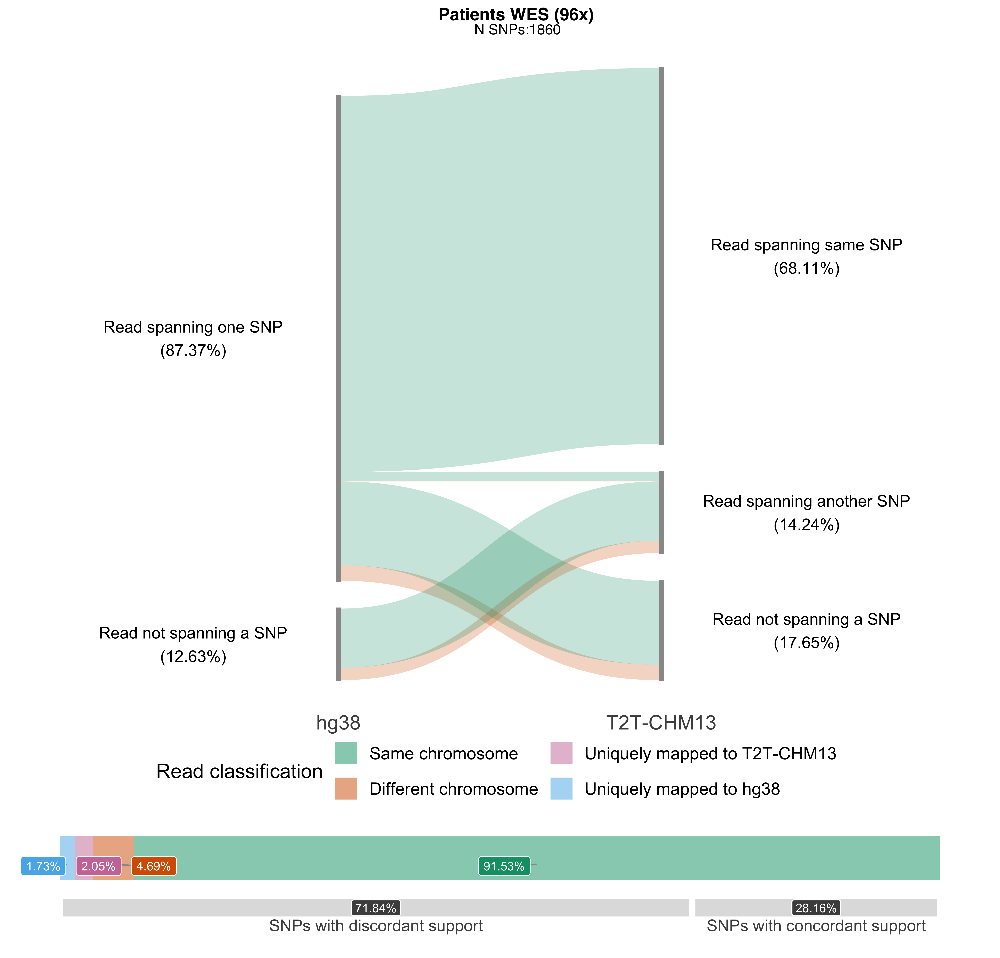
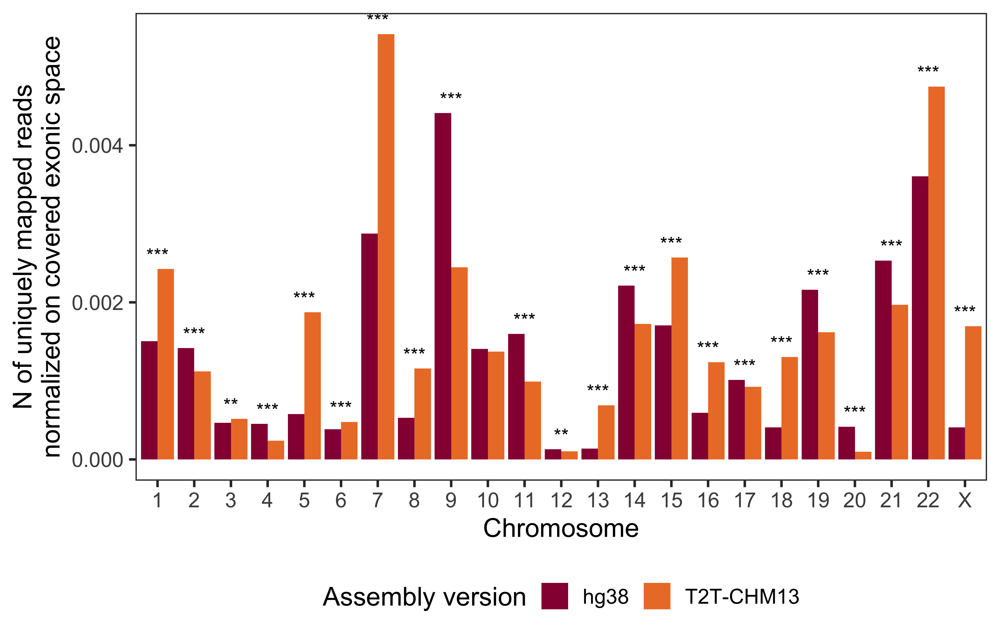
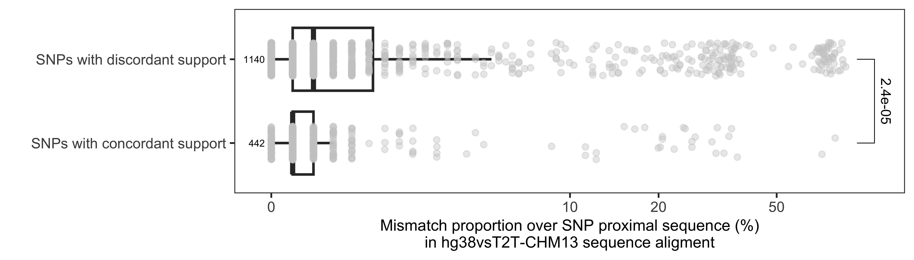
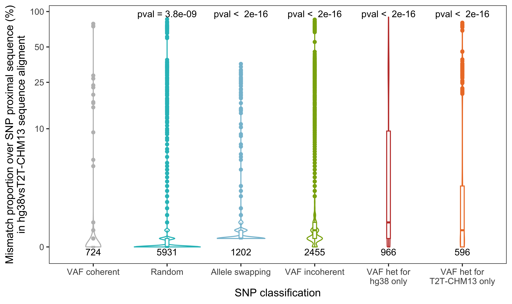
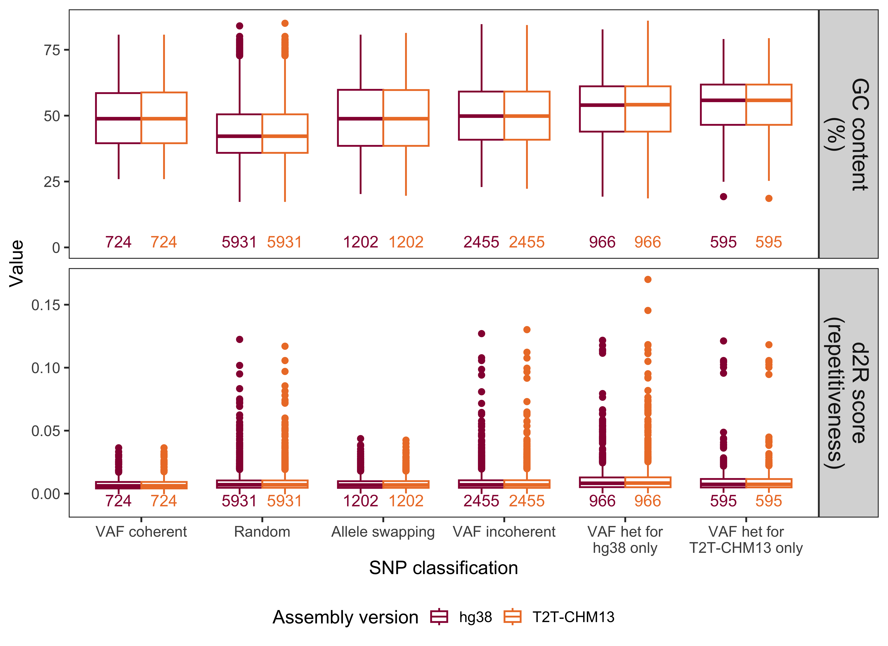
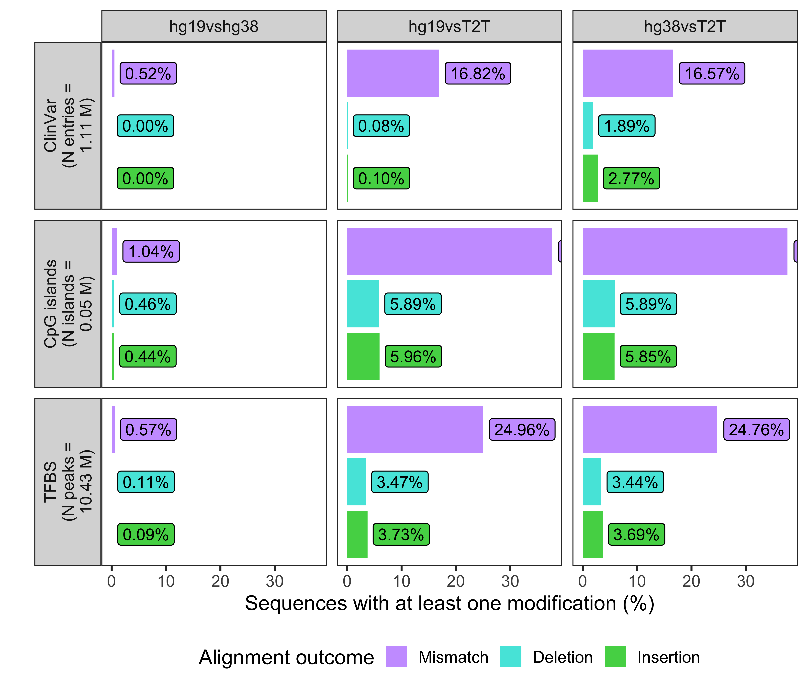
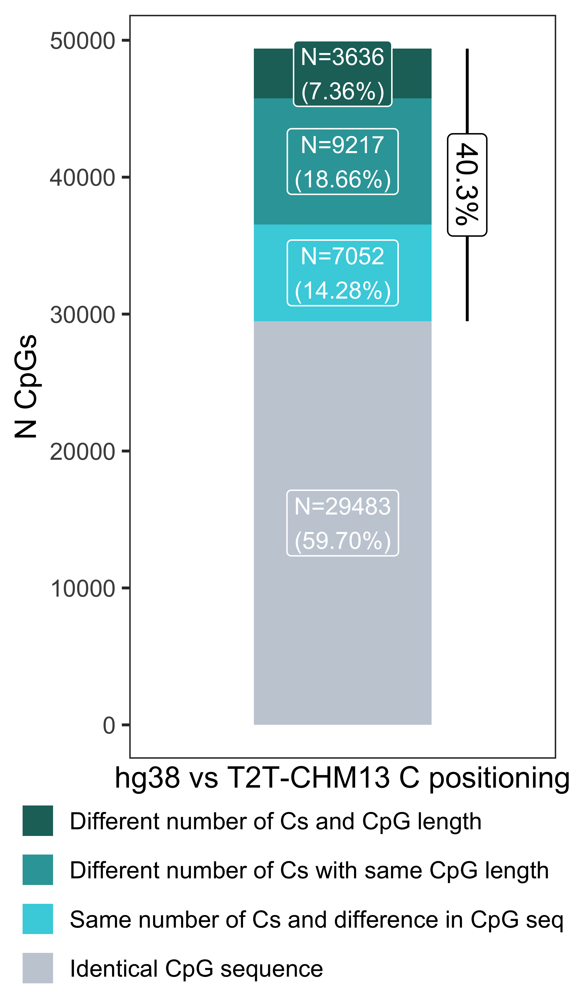
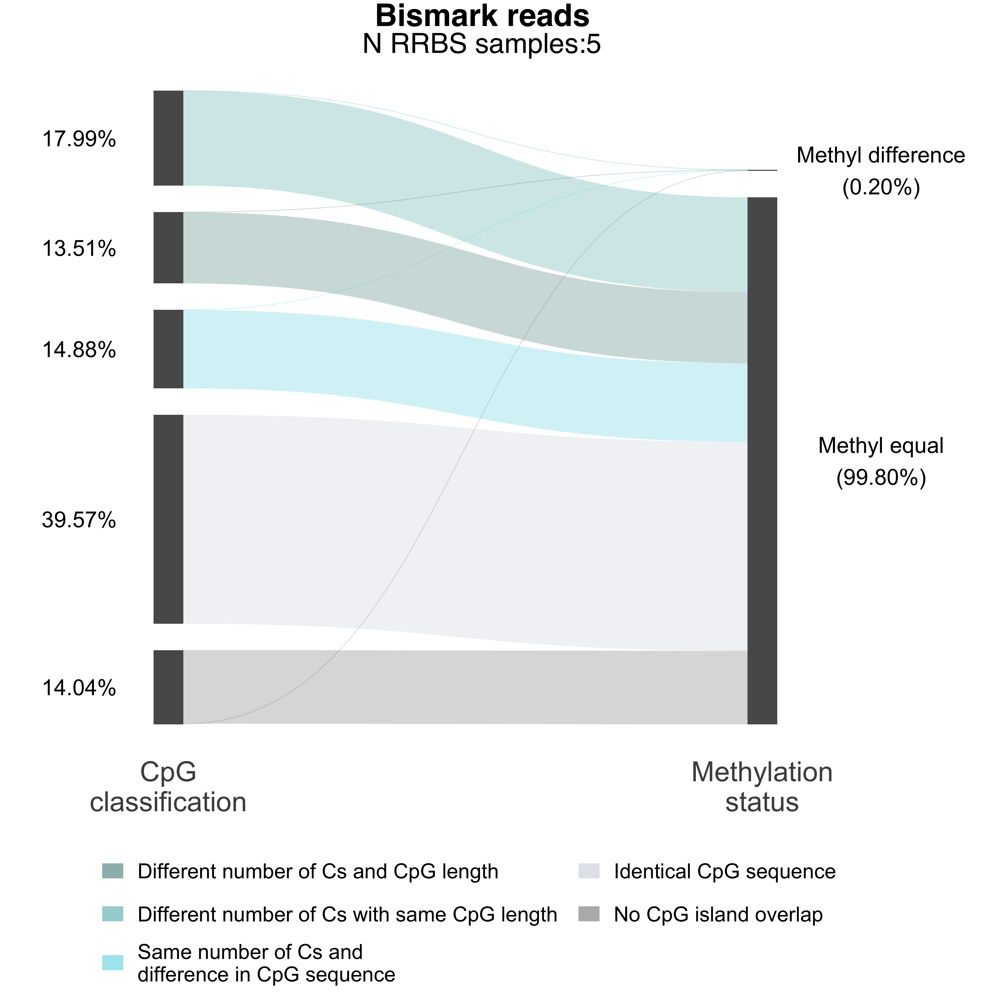
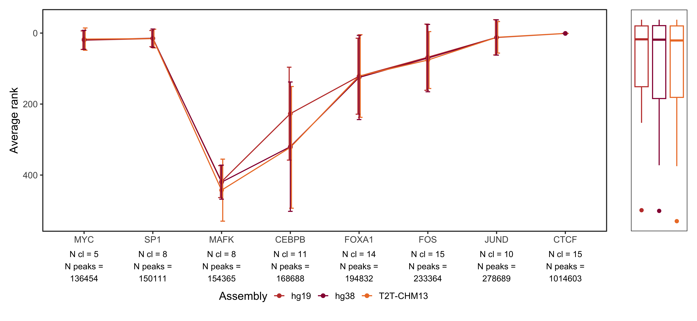

# Supplementary Figure 3

## Figure S3A

Load data:

``` r
load(paste0(rdata_path, "sankey_reads_WES_breast.RData"))

read_class_df <- bind_rows(sankey_list, .id = "sname")

read_class_df <- read_class_df %>% filter(!(supp_T2T == "Read spanning same SNP" & classification == "Different chromosome"),
                                          !(supp_hg38 == "Other"), classification != "Multiple mapping")
```

Obtain info:

``` r
one_snp <- read_class_df %>% filter(supp_hg38 == "Read spanning one SNP") %>% pull(n) %>% sum()

dc_mapping <- read_class_df %>% filter(supp_hg38 == "Read spanning one SNP" & classification == "Different chromosome") %>% pull(n) %>% sum()

um_mapping <- read_class_df %>% filter(supp_hg38 == "Read spanning one SNP" & classification == "Uniquely mapped to hg38") %>% pull(n) %>% sum()

change_mapping <- read_class_df %>% filter(supp_hg38 == "Read spanning one SNP" & (supp_T2T == "Read spanning another SNP" | supp_T2T == "Read not spanning a SNP") & classification == "Same chromosome") %>% pull(n) %>% sum()

(change_mapping/one_snp)*100
```

```
## [1] 18.49286
```

``` r
((dc_mapping/one_snp)*100 + (um_mapping/one_snp)*100)
```

```
## [1] 5.123981
```

Format data to produce a Sankey plot with percentage labels:

``` r
sum_read_class_df <- read_class_df %>% ungroup() %>% filter(
  !classification %in% c("Uniquely mapped to hg38", "Uniquely mapped to T2T")) %>%
   summarize(n = sum(n), perc = sum(n) / sum(unique(tot)), .by = c("supp_hg38", "supp_T2T", "classification")) %>% 
  ungroup() %>% mutate(edge_id = 1:n()) %>%
  pivot_longer(c(supp_hg38, supp_T2T), names_to = "Assembly", values_to = "Classification") %>%
  mutate(connector = ifelse(Assembly == "supp_T2T", "to", "from"))

labs <- sum_read_class_df %>% filter(!is.na(Classification)) %>% group_by(Assembly) %>%
  mutate(tot = sum(n)) %>% group_by(Assembly, Classification) %>%
  mutate(p = scales::percent(sum(n)/tot,0.01)) %>%
  distinct(Assembly, p, Classification) %>%
  mutate(l = paste0(Classification, "\n(",p,")"))

sum_read_class_df <- merge(sum_read_class_df %>% filter(!is.na(Classification)), labs, all.x = T) 
```

Load SNP support data:

``` r
load(paste0(rdata_path, "snp_supp_WES_breast.RData"))

snp_supp_df <- bind_rows(snp_supp_list, .id = "sname") 

snp_supp_df <- snp_supp_df %>% ungroup() %>% filter(snp_mapping != "Other") %>% dplyr::summarize(n = sum(n), tot = sum(tot), 
                                                .by = c(rsid.hg38, snp_mapping)) %>% ungroup() 

sne <- snp_supp_df %>% ungroup() %>% summarize(n=n(), .by = "snp_mapping")

labs_reads <- sne %>% ungroup() %>% mutate(cle = ifelse(snp_mapping == "Mapped on same SNP", "Same SNP", "Different SNP")) %>%
  mutate(tot = sum(n)) %>% 
  summarize(p = scales::percent(sum(n)/unique(tot),0.01), .by = "snp_mapping") %>%
  mutate(l = paste0(snp_mapping, "\n(",p,")"))

snp_supp_df <- snp_supp_df %>% ungroup() %>% dplyr::summarize(n = sum(n), tot = sum(tot), 
                                                .by = c(rsid.hg38, snp_mapping)) %>% ungroup() %>%
  group_by(rsid.hg38) %>% dplyr::slice_max(n)

labs_snps <- snp_supp_df %>% ungroup() %>% 
  mutate(cle = ifelse(snp_mapping == "Mapped on same SNP" & tot == n, "SNPs with concordant support", "SNPs with discordant support")) %>%
  summarize(n=n(), .by = "cle") %>%
  mutate(tot = sum(n)) %>% 
  summarize(p = scales::percent(sum(n)/unique(tot),0.01), n = sum(n), .by = "cle") %>%
  mutate(l = paste0(cle, "\n(",p,")"))
```

Prepare Sankey plot:

``` r
a <- (ggplot(sum_read_class_df %>% filter(!is.na(classification)),
        aes(x = Assembly, y = perc,
            connector = connector, group = Classification,
            edge_id = edge_id))
  + geom_sankeyedge(v_space = "auto", aes(fill = classification), width = 0.01, order = "as_is",
                    show.legend = F)
  + geom_sankeynode(v_space = "auto", width = 0.01, order = "as_is", fill = "gray60", color = "gray60")
  + theme_publication()
  + theme(
    axis.text.x = element_text(size = 14),
    legend.position = "bottom",
    axis.title.x = element_blank(),
    axis.title.y = element_blank(),
    axis.line.y = element_blank(),
    axis.ticks.y = element_blank(),
    axis.text.y = element_blank(),
    axis.line.x = element_blank(),
    axis.ticks.x = element_blank(),
    panel.border = element_blank()
    
  )
  + geom_text( data = . %>% filter(Assembly == "supp_T2T") ,
               aes(label = l),
               stat = "sankeynode",
               position = position_sankey(v_space = "auto", nudge_x = 0.45, order = "as_is"),
               size = 4)
  + geom_text( data = . %>% filter(Assembly == "supp_hg38"),
               aes(label = l), stat = "sankeynode",
               position = position_sankey(v_space = "auto", nudge_x = - 0.45, order = "as_is"),
               size = 4)
  + scale_x_discrete(limits = c("supp_hg38", "supp_T2T"),
                    labels = c("hg38", "T2T-CHM13"),
                    expand = c(0.5, 0.5)
  )
  + scale_fill_manual(values = setNames(cbPalette, c("Different chromosome", "Multiple mapping",
                                                                         "Same chromosome",
                                          "Uniquely mapped to hg38", "Uniquely mapped to T2T")))
  + guides(fill = guide_legend(nrow = 1))
  + coord_cartesian(clip = "off")
  + labs(y = "Percentage (%)", fill = "Classification",
        title = "Patients WES (96x)", subtitle = paste0("N SNPs:", length(unique(snp_supp_df$rsid.hg38))))
  + theme(plot.title = element_text(hjust = 0.52, size = 12, face = 'bold'),
                                             plot.subtitle = element_text(size = 10, hjust = 0.52))
)
```

Create labels

``` r
sum_read_class_df <- read_class_df %>% ungroup() %>%
   summarize(n = sum(n), perc = sum(n) / sum(unique(tot)), .by = c("supp_hg38", "supp_T2T", "classification")) %>% 
  ungroup() %>% mutate(edge_id = 1:n()) %>%
  pivot_longer(c(supp_hg38, supp_T2T), names_to = "Assembly", values_to = "Classification") %>%
  mutate(connector = ifelse(Assembly == "supp_T2T", "to", "from"))

labs <- sum_read_class_df %>% filter(!is.na(Classification)) %>% group_by(Assembly) %>%
  mutate(tot = sum(n)) %>% group_by(Assembly, Classification) %>%
  mutate(p = scales::percent(sum(n)/tot,0.01)) %>%
  distinct(Assembly, p, Classification) %>%
  mutate(l = paste0(Classification, "\n(",p,")"))

sum_read_class_df <- merge(sum_read_class_df %>% filter(!is.na(Classification)), labs, all.x = T) 
sum_read_class_df$classification <- gsub("T2T", "T2T-CHM13", sum_read_class_df$classification)
```

Prepare annotation barplot:

``` r
b <- (ggplot(sum_read_class_df %>% summarize(n = sum(n), .by = "classification") %>% 
               mutate(tot = sum(n)) %>%
               mutate(classification = factor(classification, levels = rev(c("Uniquely mapped to hg38",
                                                                             "Uniquely mapped to T2T-CHM13",
                                                                         "Different chromosome", 
                                                                         "Multiple mapping",
                                                                         "Same chromosome")))), 
        aes(y = "", x = n/tot, fill = classification))
  + geom_col(alpha = 0.5, width = 0.6, position = "fill") 
  + geom_label_repel(
      aes(label=scales::percent(n/tot)),
      direction = "x", position=position_fillnudge(vjust = 0.5, y = -0.02), color = "white", size = 3,
      segment.color = "gray60",
      segment.size = 0.5,
      force = .2,
      min.segment.length = 0,
      show.legend = F)
  + theme_publication()
  + theme(panel.grid = element_blank())
  #+ coord_flip()
  + scale_fill_manual(values = setNames(cbPalette, c("Different chromosome", "Multiple mapping",
                                                                         "Same chromosome",
                                          "Uniquely mapped to hg38", "Uniquely mapped to T2T-CHM13")))
  + labs(fill = "Read classification")
  + theme(
    #axis.text.x = element_text(size = 25),
    legend.position = "top",
    legend.title = element_text(size = 14),
    axis.title.x = element_blank(),
    axis.title.y = element_blank(),
    axis.line.y = element_blank(),
    axis.ticks.y = element_blank(),
    axis.text.y = element_blank(),
    axis.line.x = element_blank(),
    axis.ticks.x = element_blank(),
    axis.text.x = element_blank(),
    panel.border = element_blank(),
   # plot.margin = margin(0,5.5,0,5.5)
  )
  + guides(fill = guide_legend(nrow = 2))
  
)
```

Prepare bottom annotation:


``` r
c <- (ggplot(labs_snps %>% mutate(cle = factor(cle, levels = c("SNPs with concordant support", "SNPs with discordant support"))) , 
        aes(x = "", y = n, fill = cle))
  + geom_col(alpha = 0.5, show.legend = F, width = 0.5, position = "fill",
             color = "white", fill = "gray", lwd = 2) 
  + geom_label(aes(label = p), position = position_fill(.5), color = "white", show.legend = F,
                   fill = "gray30", vjust = 0.5, angle = 0, size = 3) 
  + geom_text(aes(label = cle), position = position_fill(.5), color = "gray30", show.legend = F, 
                   vjust = 2, angle = 0, size = 4) 
  

  + theme_publication()
  + coord_flip(clip = "off")
  + theme(panel.grid = element_blank())
  + theme(
    #axis.text.x = element_text(size = 25),
    legend.position = "bottom",
    axis.title.x = element_blank(),
    axis.title.y = element_blank(),
    axis.line.y = element_blank(),
    axis.ticks.y = element_blank(),
    axis.text.y = element_blank(),
    axis.line.x = element_blank(),
    axis.ticks.x = element_blank(),
    axis.text.x = element_blank(),
    panel.border = element_blank()
  )
)
```

Compose final figure:

``` r
(a + theme(plot.margin = margin(-3,0,0,0))) + 
  (b + theme(plot.margin = margin(-5,0,-3,0), legend.margin = margin(5,5,-10,0))) + 
  plot_spacer() + 
  (c + theme(plot.margin = margin(0,0,10,0))) + 
  plot_layout(heights = c(12,2,-1.000005,1), ncol = 1)
```

<!-- -->


## Figure S3B

Load data on differential chromosome mapping:

``` r
load(paste0(rdata_path, "chr_diff_WES_breast.RData"))

chr_df <- bind_rows(chr_list, .id = "sname") 

chr_read_class_df <- chr_df %>% filter(!chr.hg38 %in% paste0("chr", c("X", "Y")) , 
                                       !chr.T2T %in% paste0("chr", c("X", "Y"))) %>%
  group_by(sname) %>% mutate(tot = sum(n)) %>% ungroup() %>%
  group_by(chr.hg38, chr.T2T, ID_exome.hg38, ID_exome.T2T) %>%
  summarize(n = sum(n), perc = sum(n) / sum(tot)) %>% ungroup() %>% mutate(edge_id = 1:n()) %>%
   pivot_longer(c(chr.hg38, chr.T2T), names_to = "Assembly", values_to = "Classification") %>%
   mutate(connector = ifelse(Assembly == "chr.T2T", "to", "from"))

# Exome capturing
exome_bed <- bind_rows("T2T" = exome_bed_T2T %>% summarize(size = sum(end-start), .by =c("name","chr")) %>% mutate(ID_exome = 1:n()),
                     "hg38" = exome_bed_hg38 %>% summarize(size = sum(end-start), .by =c("name","chr")) %>% mutate(ID_exome = 1:n()),
                     .id = "Assembly") 
exome_bed <- exome_bed %>% distinct(chr, size, ID_exome, Assembly) %>% group_by(Assembly, chr) %>%
  mutate(size_chr = sum(size))

# Annotate
chr_read_class_df <- left_join(chr_read_class_df %>% 
                                 mutate(chr = Classification, 
                    ID_exome = ifelse(grepl("T2T", Assembly), ID_exome.T2T, ID_exome.hg38)), 
exome_bed %>% mutate(Assembly = paste0("chr.", Assembly)), by = c("ID_exome", "Assembly"))

labs <- chr_read_class_df %>% group_by(Assembly) %>%
  mutate(tot = sum(n)) %>% group_by(Assembly, Classification) %>%
  mutate(p = scales::percent(sum(size[unique(ID_exome) & !is.na(ID_exome)]) / size_chr ,0.01), 
         n.reads = sum(n)) %>%
  distinct(Assembly, p, Classification, n.reads) %>%
  mutate(l = paste0(Classification, " (N = ", n.reads,"; ",p,")"))

chr_read_class_df <- merge(chr_read_class_df, labs, all.x = T) 

chr_read_class_df <- chr_read_class_df  %>% 
          mutate(Classification = factor(Classification, levels = rev(paste0("chr", c(1:22, "X", "Y"))))) %>%
          group_by(Classification) %>% mutate(exome_mapping = length(unique(ID_exome.hg38))) %>% ungroup()
```


``` r
(ggplot(chr_read_class_df,
        aes(x = Assembly, y = perc,
            connector = connector, group = Classification,
            edge_id = edge_id))
  + geom_sankeyedge(v_space = "auto", width = 0.05, aes(fill = exome_mapping), order = "as_is")
  + geom_sankeynode(v_space = "auto", width = 0.05, order = "as_is")
  + labs(y = "Percentage (%)", fill = "N of covered exons (hg38)")
  + theme_publication()
  + theme(
    axis.text.x = element_text(size = 14),
    legend.position = "bottom",
    axis.title.x = element_blank(),
    axis.title.y = element_blank(),
    axis.line.y = element_blank(),
    axis.ticks.y = element_blank(),
    axis.text.y = element_blank(),
    axis.line.x = element_blank(),
    axis.ticks.x = element_blank(),
    panel.border = element_blank()
   
  )
  + geom_text( data = . %>% filter(Assembly == "chr.T2T") ,
               aes(label = l),
               stat = "sankeynode",
               position = position_sankey(v_space = "auto", nudge_x = 0.3, order = "as_is"),
               cex = 4)
  + geom_text( data = . %>% filter(Assembly == "chr.hg38"),
               aes(label = l), stat = "sankeynode",
               position = position_sankey(v_space = "auto", nudge_x = - 0.3, order = "as_is"),
               cex = 4)
  + scale_fill_gradient(high = "#f2c43d", low = "gray", breaks = round)
  + scale_x_discrete(limits = c("chr.hg38", "chr.T2T"),
                     #expand = c(.0, .1),
                     labels = c("hg38", "T2T-CHM13")
  )
 + guides (fill = guide_colourbar(barwidth = 10))
)
```

<!-- -->

## Figure S3C


``` r
load(paste0(rdata_path, "unique_reads_WES_breast.RData"))
unique_df <- bind_rows(unique_list, .id = "sname") 

unique_df <- unique_df %>% group_by(chr, assembly) %>%
  summarize(n = sum(n), med_mapqual = median(med_mapqual))

unique_df <- unique_df %>% mutate(chr = gsub("chr", "", chr)) %>% filter(chr %in% paste0("", c(1:22, "X"))) %>% 
  mutate(chr = factor(chr, levels = paste0("", c(1:22, "X")))) %>%
  ungroup() %>% mutate(tot = sum(n))


bed <- bind_rows("T2T" = exome_bed_T2T %>%  mutate(chr = gsub("chr", "", chr)),
                     "hg38" = exome_bed_hg38 %>%  mutate(chr = gsub("chr", "", chr)),
                     .id = "assembly") %>% mutate(len = end - start) %>% 
  summarize(size = sum(len), .by = c(chr, assembly))

unique_df <- merge(unique_df, bed)

unique_df <- unique_df %>% group_by(chr)

unique_df <- unique_df %>% arrange(chr)

# Perform test
res <- unique_df %>% group_by(chr) %>% filter(n()==2) %>% ungroup() %>%
  reframe(cbind(as.data.frame.table(
           pairwise.prop.test(setNames(n, assembly), size)$p.value)),
          .by = chr) %>% 
  drop_na(Freq) %>% ungroup() %>% mutate(signif = as.character(signif.num(Freq))) %>% 
  dplyr::rename(group1 = Var1, group2 = Var2, p.adj.signif = signif) 

res <- merge(merge(res,
                 unique_df %>% dplyr::rename(group1=assembly) %>% mutate(n1=n/size) %>% dplyr::select(chr,group1,n1),all.x=T),
           unique_df %>% dplyr::rename(group2=assembly) %>% mutate(n2=n/size) %>% dplyr::select(chr,group2,n2),all.x=T)

res <- res %>% rowwise() %>% mutate(y.position=max(n1,n2), x = chr) %>% ungroup()
```


``` r
(ggplot(unique_df, aes(x = chr, y = n / size))
  + geom_col(aes(fill = assembly, group = assembly),position = position_dodge())
  + theme_publication()
  + theme(panel.grid = element_blank(), legend.position = "bottom")
  + labs(y = "N of uniquely mapped reads\nnormalized on covered exonic space", x = "Chromosome", fill = "Assembly version")
  + scale_fill_manual(values = c("hg38" = "#960340", "T2T" = "#ED7D31"),
                      labels = c("hg38", "T2T-CHM13"))
  + stat_pvalue_manual(
         data = res , x = "chr", vjust = -0.5,
        tip.length = 0.01
       )
)
```

<!-- -->

## Figure S3D

Load outcome of sequence comparison analysis:

``` r
tb <- fread(paste0(tables_path, "snp_seq_comp_paiwise.tsv"))
load(paste0(rdata_path, "colnames_seq_comp.RData"))
load(paste0(rdata_path, "cons_comp.RData"))
colnames(tb) <- cvec

tb$rsid <- ifelse(is.na(tb$rsid), tb$ID, tb$rsid)
```

Format data:

``` r
aln_df <- tb %>% filter(!grepl("\\|",type)) %>% distinct(rsid, type, al_hg38T2T) %>%
  rowwise() %>%
  mutate(expanded = list(compact_string_to_df(al_hg38T2T))) %>%
  unnest(expanded) %>% mutate(Symbol = case_when(Symbol == "+" ~ "Insertion",
                                               Symbol == "-" ~ "Deletion",
                                               Symbol == "?" ~ "Mismatch",
                                               .default = "No"))

aln_sum <- left_join(aln_df %>% summarize(.by = "rsid", mism = sum(n_bases[Symbol == "Mismatch"]),
                                  prop = mism / 301),
                     cons_comp %>% distinct(rsid, cl) %>% dplyr::rename(type = cl), by = "rsid") %>%
    filter(prop < 1)  %>% mutate(type = ifelse(is.na(type), "Random", as.character(type)))
```

Create df from previously loaded SNP support data:

``` r
snp_supp_df <- bind_rows(snp_supp_list, .id = "sname")

snp_supp_df <- snp_supp_df %>% ungroup() %>% dplyr::summarize(n= sum(n), tot = sum(tot),
                                                .by = c(rsid.hg38, snp_mapping)) %>% ungroup() %>%
  group_by(rsid.hg38) %>% dplyr::slice_max(n)
```


``` r
se <- merge(aln_sum, snp_supp_df %>% dplyr::rename(rsid = rsid.hg38), by = "rsid")
se <- se %>% mutate(class = case_when(snp_mapping == "Mapped on same SNP" & (tot == n)  ~ "SNPs with concordant support",
                      .default = "SNPs with discordant support"))
```


``` r
(ggplot(se %>% filter(!is.na(prop)), aes(x = class, y = prop*100))
  + theme_publication()
  + geom_boxplot( show.legend = F, lwd = 1, outlier.shape = NA)
  + geom_jitter(alpha = 0.4, color = "gray80", width = 0.2, height = 0.001)
  + stat_compare_means(comparisons =
                         list(c("SNPs with discordant support", "SNPs with concordant support")),
                       size = 4,
                       method.args = list("greater"))
  + coord_flip()
  + scale_y_continuous(trans = scales::pseudo_log_trans(), breaks = c(0,10,20,50))
  + labs(x = "", y = "Mismatch proportion over SNP proximal sequence (%)\nin hg38vsT2T-CHM13 sequence aligment", fill = "Assembly version")
  + theme(axis.title.x = element_text(size = 13))
  + stat_summary(fun.data = function(x) {    return(c(y = -0.05, label = length(x)))  },
                   geom = "text",
                  size = 8/.pt, vjust = 0.5, hjust = 1)
  )
```

<!-- -->

## Figure S3E

``` r
dt <- fread(paste0(tables_path, "ranges_seq.tsv"))

dt <- dt %>% filter(chr != "chrY")
dt$chr <- factor(dt$chr, levels = paste0("chr", c(1:22,"X")))
dt$type <- as.character(dt$type)
```

Plot:

``` r
aln_sum <- aln_sum %>% mutate(type = factor(type, 
                                            levels = c("VAF consistent", "Random",
                 "Allele swapping", "VAF inconsistent", "VAF het for hg38 only",
                 "VAF het for T2T-CHM13 only")) )
(ggplot(aln_sum %>% filter(prop >= 0), aes(x = type, y = prop*100))
  + geom_violin( aes(color = type), show.legend = F)
  + geom_boxplot(aes(color = type), width = 0.05, show.legend = F)
  + theme_publication()
  + stat_compare_means(ref.group = "VAF consistent",  aes(label = gsub(" = <", " < ", paste0("pval = ",..p.format..))), vjust = 0,
                       size = 13/.pt, method.args = list(alternative = "greater"))
  + scale_y_continuous(trans = scales::pseudo_log_trans(1), breaks = c(0,10,25,50,100))
  + labs(x = "SNP classification", 
         y = "Mismatch proportion over SNP proximal sequence (%)\nin hg38vsT2T-CHM13 sequence aligment", 
         fill = "Assembly version")
  + theme(legend.position = "bottom", panel.grid = element_blank())
  + stat_summary(fun.data = function(x) {    return(c(y = -0.1, label = length(x)))  }, 
                 geom = "text", position = position_dodge(width = 0.75),size=13/.pt) 
  + scale_color_manual(values = c("Random" = "#29bec3",
                                  palette_VAF),
                      )
  + scale_x_discrete(labels = c( "VAF coherent","Random", "Allele swapping","VAF incoherent", 
                                   "VAF het for\nhg38 only", "VAF het for\nT2T-CHM13 only"
                                  ) )
)
```

<!-- -->

## Figure S3F
Plot:


``` r
plot_tb <- tb %>% filter(!is.na(d2R.hg38) & !is.na(d2R.T2T)) %>% 
  pivot_longer(cols = c(contains(".")), names_to = c("measure","assembly"), 
                               values_to = "value", names_sep = "\\.") 


plot_tb <- left_join(plot_tb %>% dplyr::select(-c(type)),
                     cons_comp %>% distinct(rsid, cl) %>% dplyr::rename(type = cl), by = "rsid")

plot_tb <- plot_tb %>%
  filter(!grepl("\\|",type)) %>%
  mutate(type = factor(ifelse(is.na(type), "Random", as.character(type)), 
                       levels = c("VAF consistent", "Random",
                 "Allele swapping", "VAF inconsistent", "VAF het for hg38 only",
                 "VAF het for T2T-CHM13 only"))) 

(ggplot(plot_tb %>% filter(measure %in% c("gc","d2R")) %>%
          mutate(measure = factor(ifelse(measure == "gc", 
                                         "GC content\n(%)", 
         ifelse(measure == "d2R", "d2R score\n(repetitiveness)",
                                                "Levenshtein\nsimilarity")),
         levels = c("Levenshtein\nsimilarity","GC content\n(%)", "d2R score\n(repetitiveness)"))), 
        aes(x = type, y = value, color = assembly))
  + geom_boxplot(position="dodge")
  + theme_publication()
  + facet_grid(measure ~ ., scales = "free_y")
  + stat_compare_means(aes(group = assembly), 
                        label = "p.signif", 
                       paired = T, method = "wilcox.test", show.legend = F, size=13/.pt, hide.ns = T)
  + scale_color_manual(values = c("hg38" = "#960340", "T2T" = "#ED7D31"),
                       labels = c("hg38", "T2T-CHM13"))
  + labs(x = "SNP classification", y = "Value", color = "Assembly version")
  + theme(legend.position = "bottom")
  + stat_summary(fun.data = function(x) {    return(c(y = -0.01, label = length(x)))  }, 
                 geom = "text", position = position_dodge(width = 0.75),size=13/.pt,vjust=0, show.legend = F) 
  + ggh4x::facetted_pos_scales(    
    y = list(
      scale_y_continuous(limits = c(-0.01, NA)),
      scale_y_continuous(limits = c(-0.01, NA))
    ))
  + theme(strip.text = element_text(size = 18))
  + scale_x_discrete(labels = c( "VAF coherent","Random", "Allele swapping","VAF incoherent", 
                                   "VAF het for\nhg38 only", "VAF het for\nT2T-CHM13 only"
                                  ) )
)
```

<!-- -->

# Supplementary 4

## Figure S4A

Load data:

``` r
all_tracks <- fread(paste0(tables_path, "summary_tracks.tsv"))
all_tracks <- all_tracks %>% 
  mutate(Symbol = factor(Symbol, levels = rev(c("Match", "Mismatch", "Deletion", "Insertion")))) %>% 
  filter(Symbol != "Match") 
```


``` r
(ggplot(all_tracks %>%
          mutate(total_bases = (EVENT/prop_bases_event),
                 perc_event_num = as.numeric(sub("%","",perc_peaks_event))), 
        aes( y = Symbol, x = perc_event_num, fill = Symbol))
  + geom_col()
  + scale_fill_manual(values = palette_pairwise,
                       breaks = c("Match", "Mismatch", "Deletion", "Insertion"))
  + theme_publication()
  + facet_grid(track ~ comparison,  switch = "y", space = "free_x")
  + labs (y = "", x = "Sequences with at least one modification (%)", fill = "Alignment outcome")
  + geom_label(data = . %>% filter(!(Symbol == "Mismatch" & comparison %in% c("hg19vsT2T-CHM13", "hg38vsT2T-CHM13"))), 
               aes(label = perc_peaks_event ), hjust = -0.1, size = 12/.pt, show.legend = F)
  + geom_label(data = . %>% filter(Symbol == "Mismatch" & comparison %in% c("hg19vsT2T-CHM13", "hg38vsT2T-CHM13")), 
               aes(label = perc_peaks_event ), hjust = 1.1, size = 12/.pt, show.legend = F)
  + theme(legend.position = "bottom", axis.text.y = element_blank(), axis.ticks.y = element_blank())
)
```

<!-- -->

## Figure S4B
Load data:


``` r
load(paste0(rdata_path,"cpg_class.RData"))
```


``` r
tp <- cpg_comp %>% 
          mutate(classification = factor(classification, levels = c(
            "Different number of Cs and CpG length",
            "Different number of Cs with same CpG length",
            "Same number of Cs and\ndifference in CpG sequence",
            "Identical CpG sequence" 
          ))) %>% summarize(N=n(), def = "CpG", .by = "classification") %>% distinct() 
(ggplot(tp,
        aes(x = def, y = N, fill =  classification))
  + geom_col(position = "stack", width = 0.5) 
  + theme_publication()
  + labs(x="hg38 vs T2T-CHM13 C positioning", y="N CpGs", fill="Classification")
  + scale_fill_manual(values=c("Different number of Cs and CpG length" = "#1e7069",
                              "Different number of Cs with same CpG length" = "#32a4a7",
                              "Same number of Cs and\ndifference in CpG sequence" = "#44d1df",
                              "Identical CpG sequence" = "#c6cdd7"),
                       labels = c("Different number of Cs and CpG length",
             "Different number of Cs with same CpG length",
             "Same number of Cs and difference in CpG seq",
             "Identical CpG sequence" )
            )
  + geom_label(aes(label = paste0("N=",N,"\n(",scales::percent(N/nrow(cpg_comp),0.01),")")),
             position = position_stack(vjust=0.5),
            show.legend = F, color = "white",
            size = 12/.pt)
  + theme(axis.text.x = element_blank(), 
          axis.ticks.x = element_blank(), 
          legend.position = "bottom",
          legend.justification = "left",
          legend.margin=margin(0,0,0,0),
        legend.box.margin=margin(-10,-10,0,-55),
         legend.title = element_blank())
  + guides(fill=guide_legend(ncol=1))
  + annotate("segment", x = 1.35, xend = 1.35, 
             y = sum(tp$N) - sum(tp$N[tp$classification != "Identical CpG sequence"]), 
             yend = sum(tp$N))
  + annotate("label", x = 1.35, angle = 270, hjust = 0.5, vjust = 0.5,
             y = ((sum(tp$N) - sum(tp$N[tp$classification != "Identical CpG sequence"])) + sum(tp$N)) / 2, 
             label = scales::percent(round(
               sum(tp$N[tp$classification != "Identical CpG sequence"]) / sum(tp$N), 3), 0.1))

)
```

<!-- -->
Percentage of CpGs with non identical CpG sequence that have a different number or Cs:


``` r
scales::percent(round(sum(tp$N[!tp$classification %in% c("Identical CpG sequence",                                                    "Same number of Cs and\ndifference in CpG sequence")]) 
                      / 
                        sum(tp$N[tp$classification != "Identical CpG sequence"]), 2), 0.1)
```

```
## [1] "65.0%"
```


## Figure S4C
Load data:


``` r
load(paste0(rdata_path,"RRBS_meth_comp.RData"))

nsamples <- 5
cp = compare_reads %>% mutate(total = rep(nrow(compare_reads),n())) %>% group_by(status, classification, total) %>% 
  summarize(n=n(), perc = n/unique(total), fe = unique(classification)) %>% ungroup() %>% mutate(edge_id = 1:n()) %>% 
  pivot_longer(c(status, classification), names_to = "Approach", values_to = "Classification") %>%
  mutate(connector = ifelse(Approach == "status", "to", "from"))

#cp <- cp %>% filter(fe != "No CpG island overlap")
labs <- cp %>% ungroup() %>% group_by(Approach) %>% mutate(tot = sum(n)) %>% ungroup() %>% 
  group_by(Approach, Classification) %>%
  mutate(p = scales::percent(sum(n)/tot,0.01)) %>%
  mutate(l = ifelse( !grepl("Methyl", Classification),  p, paste0(Classification, "\n(",p,")")))  %>% distinct(l)

ce <- merge(cp, labs, all.x = T) 
ce$Classification <- factor(ce$Classification, 
                            levels = c("No CpG island overlap","Identical CpG sequence","Methyl equal",
                                       "Same number of Cs and\ndifference in CpG sequence", "Different number of Cs and CpG length",
                                       "Different number of Cs with same CpG length","Methyl difference"))
```


``` r
(ggplot(ce %>% arrange(Classification),
        aes(x = Approach, y = perc, 
            connector = connector, group = Classification,
            edge_id = edge_id))
  + geom_sankeyedge(v_space = "auto", aes(fill = fe), width = 0.05, order = "as_is")
  + geom_sankeynode(v_space = "auto", width = 0.05, order = "as_is")
  + scale_fill_manual(values = c(
    "Different number of Cs and CpG length" = "#1e7069",
    "Different number of Cs with same CpG length" = "#32a4a7",
    "Same number of Cs and\ndifference in CpG sequence" = "#44d1df",
    "Identical CpG sequence" = "#c6cdd7",
    "No CpG island overlap" = "gray40"
  ))
  + labs(y = "Percentage (%)", fill = "Classification",
         subtitle = paste0("N RRBS samples:", nsamples ),
         title = "Bismark reads")
  + theme_publication()
  + theme(
    axis.text.x = element_text(size = 16),
    legend.position = "bottom",
    panel.border = element_blank(),
    axis.title.x = element_blank(),
    axis.title.y = element_blank(),
    axis.line.y = element_blank(),
    axis.ticks.y = element_blank(),
    axis.text.y = element_blank(),
    axis.line.x = element_blank(),
    axis.ticks.x = element_blank(),
    legend.title = element_blank(),
    plot.title = element_text(hjust = 0.52, size = 18, face = 'bold'),
    plot.subtitle = element_text(size = 16, hjust = 0.52)
  )
  + geom_text( data = . %>% filter(Approach == "status") , 
               aes(label = l),
               stat = "sankeynode", 
               position = position_sankey(v_space = "auto", nudge_x = 0.2, order = "as_is"),
               cex = 4.5)
  + geom_text( data = . %>% filter(Approach == "classification"), 
               aes(label = l), stat = "sankeynode", 
               position = position_sankey(v_space = "auto", nudge_x = - 0.15, order = "as_is"),
               cex = 4.5)
  + scale_x_discrete(limits = c("classification", "status"),
                     labels = c("CpG\nclassification", "Methylation\nstatus"),
                     expand = c(-0.7, -0.7)
  )
  + guides(fill = guide_legend(ncol=2))
 + theme(plot.margin = margin(2,0,2,-40))
)
```

<!-- -->

## Figure S4D
Load data:

``` r
load(paste0(rdata_path, "scatter_mismatch.RData"))
```


``` r
main_plot <- (ggplot(plot_tp,
        aes(x = space / 1e6, y = prop_space*100 ))
  + geom_hline(yintercept = median(plot_tp$prop_space*100), color = "gray")
  + geom_point(aes(color = pp), size = 2)
  + theme_publication()
  + geom_text_repel(aes(label = TF), size = 18/.pt)
  + scale_color_gradient(low = "gray80", high = "#bf4770", na.value = NA,
                         limits = c(min(plot_tp$pp), max(plot_tp$pp)),
                         breaks = scales::pretty_breaks(n=5)(min(plot_tp$pp):max(plot_tp$pp)))
  + labs(x = "Genomic space covered by peaks (Mb)", 
         y = "Proportion of mismatches per TF (%)\n(hg38 vs T2T-CHM13 alignment)", 
         color = "Percentage of peaks with > 5 mismatches (%)"
         )
  + theme(panel.grid = element_blank(), legend.position = "bottom")
  + geom_xsidedensity(aes(x = space / 1e6), orientation = "x" ) 
  + geom_ysideboxplot(aes(y = prop_space*100), orientation = "x") 
  + scale_ysidex_discrete(breaks = NULL, expand = c(0.5,0.5))
)

inset_plot <- (ggplot(plot_tp,
                      aes(x = space / 1e6 , y = n_peaks ))
               + geom_point(size = 1)
               + theme_publication()
               + geom_text_repel(aes(label = TF))
               + labs(y = "N peaks", 
                      x = "Genomic space covered by peaks (Mb)")
               + theme(panel.grid = element_blank(),
                       axis.text = element_text(size = 14),
                       axis.title = element_text(size = 18))
               + stat_cor()
)

main_plot + 
  annotation_custom(
    ggplotGrob(inset_plot), 
    xmin = 100, xmax = 150, ymin = 0.5, ymax = 0.9
  )
```

<!-- -->

## Figure S4E
Load data:


``` r
summary_tfbs <- fread(paste0(tables_path, "selected_TFs_cl.tsv"))
load(paste0(rdata_path, "ame_rank_TF.RData"))
sm_tfbs <- summary_tfbs %>% summarize(n_cl = length(unique(cell_line)),
                                      n_pk = sum(n_peaks), .by = "TF") %>%
  dplyr::rename(TF_name = TF) %>% mutate(N = paste0("N cl = ", n_cl,"\nN peaks =\n", 
                                                    n_pk))
```


``` r
ra <- merge(rank_df %>% filter(!is.na(rank), TF_name == toupper(motif_alt_ID) & 
                                 as.numeric(`adj_p-value`) < 0.01) %>% 
              mutate(rank = as.numeric(rank)) %>% 
  group_by(assembly, TF_name) %>%
  summarise(
    avg_rank = median(rank),
    rank_sd = sd(rank),
    non_na = length(rank)
    ), sm_tfbs) %>% 
  mutate(combined_score = (avg_rank + rank_sd)  / (non_na / n_cl) )

a <- (ggplot(ra, aes(x = reorder(TF_name, n_pk), y = avg_rank, color = assembly))
      + theme_publication()
      + geom_line(aes(group = assembly))
      + geom_point()
      + geom_errorbar(aes(ymin = avg_rank - rank_sd, ymax = avg_rank + rank_sd), width = .2,
                    position = position_dodge(0.05))
      + scale_y_reverse()
      + scale_color_manual(values = c("T2T" = "#ED7D31", "hg38" = "#960340", "hg19" = "#C24039"),
                           labels = c("hg19", "hg38", "T2T-CHM13"))
      + labs(x = "", y = "Average rank", color = "Assembly")
      + geom_text(data = . %>% filter(assembly == "T2T") %>% ungroup() %>% distinct(TF_name, N, n_cl, n_pk),
                  aes(label = N, y = max(ra$avg_rank)) , color = "black", vjust = 3, show.legend = F, size = 4)
      + theme(legend.position = "bottom", panel.grid = element_blank(),
              legend.box.margin = margin(20,5,5,5))
      + coord_cartesian(clip = "off")
)

b <- (ggplot(ra, aes(x = assembly, y = avg_rank, color = assembly))
      + theme_publication()
      + geom_boxplot(show.legend = F)
      + scale_y_reverse()
      + scale_color_manual(values = c("T2T" = "#ED7D31", "hg38" = "#960340", "hg19" = "#C24039"),
                           labels = c("hg19", "hg38", "T2T-CHM13"))
      + labs(x = "", y = "", color = "Assembly")
      + theme(axis.ticks.x = element_blank(), axis.text.x = element_blank(),
              axis.ticks.y = element_blank(), axis.text.y = element_blank(),
              panel.grid = element_blank())
      #+ stat_compare_means(paired = T, show.legend = F)
)

a + b + plot_layout(widths = c(10,1))
```

<!-- -->


